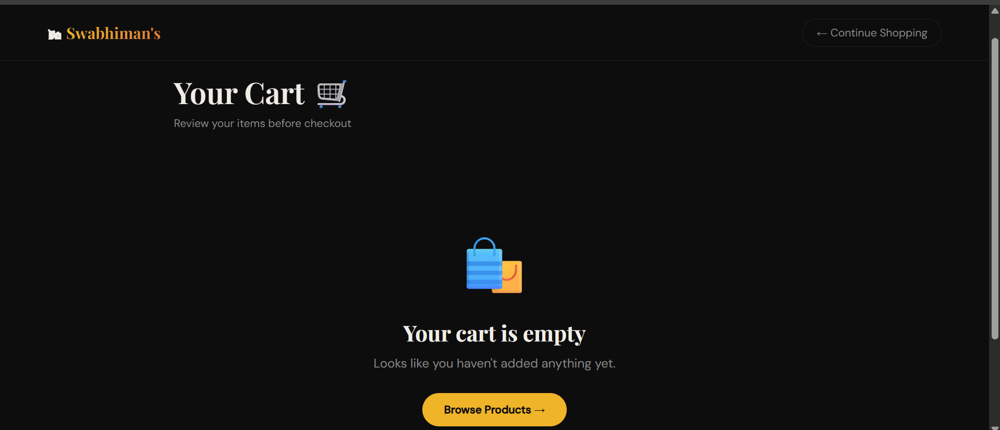
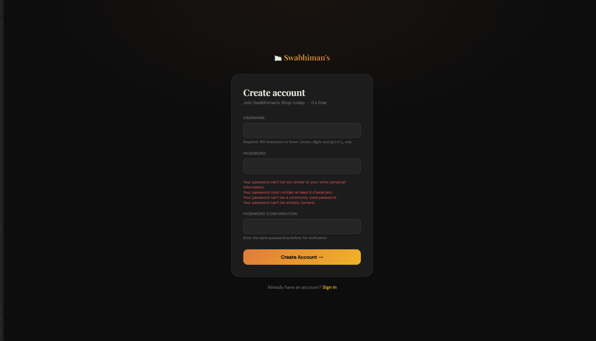

# Swabhiman Jena

### Full Stack Developer • Python Developer • Backend Enthusiast

 

---

## About Me

I’m a **Full Stack Developer** passionate about building scalable web applications and solving real-world problems through clean architecture and efficient backend systems.

- B.Tech in Computer Science  
- Strong foundation in Python & Web Development  
- Interested in Backend Engineering and Full Stack Systems  
- Focused on writing maintainable, production-ready code  

---

## Tech Stack

### Languages

### Frontend

### Backend & Database

### Tools

---

# Featured Projects

## NeoBank — Digital Banking Wallet Platform

A secure full-stack banking wallet platform with wallet management, fund transfers, transaction tracking, and KYC verification.

### Key Features
- Authentication & Authorization
- Wallet Management
- Fund Transfers
- Transaction History
- KYC Verification
- Role-based Access Control

### Tech Stack
React • Spring Boot • JWT • MySQL • REST API

---

### Login

### Dashboard

### Wallet

### Transactions

### KYC

---

## E-Commerce Platform

A full-stack e-commerce application featuring product browsing, authentication, and cart management.

### Key Features
- Product Catalog
- Authentication
- Cart System
- Responsive Design

### Tech Stack
Python • Django • SQLite • HTML • CSS

### 🏠 Home Page

--- 

### 🛒 Cart Page
 

--- 

### 📝 Signup Page 

---

## GitHub Analytics

  
  

---

### “Build with purpose. Learn continuously.”

