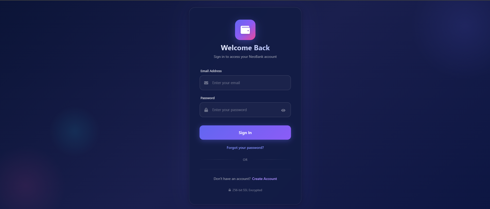
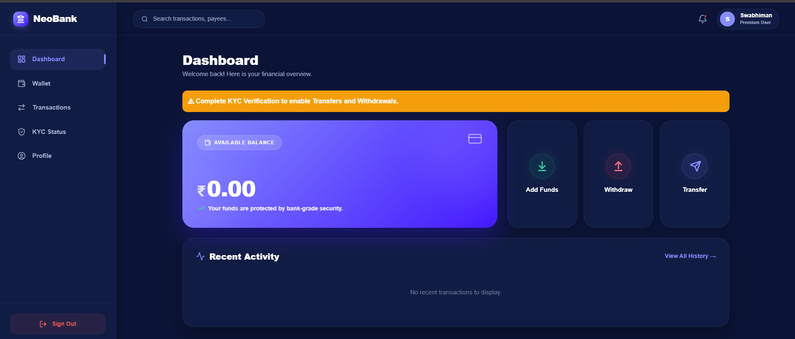
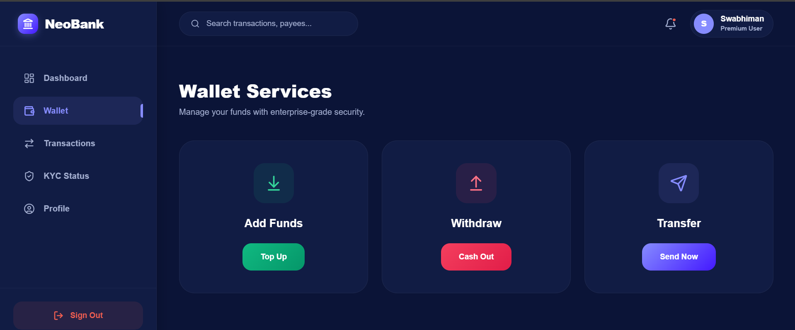
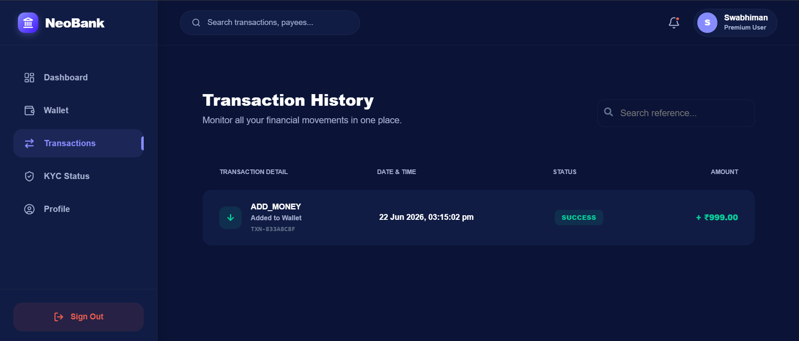
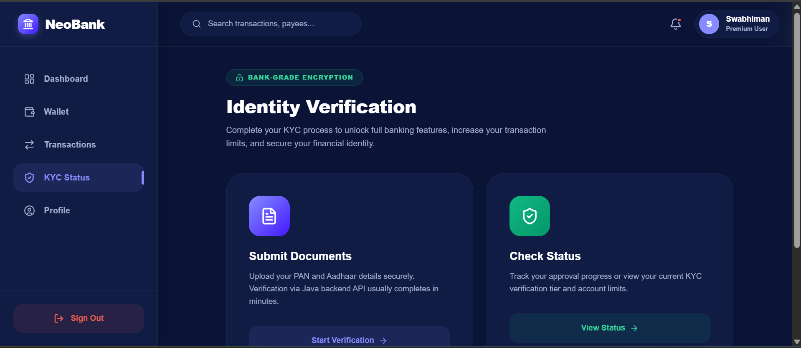
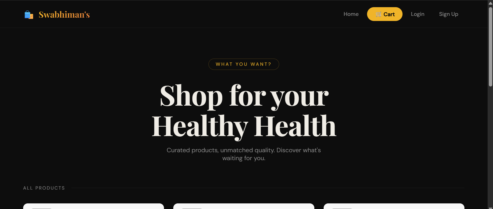

<h1 align="center">🚀 Swabhiman Jena</h1>
<h3 align="center">Python Full Stack Developer | Django Developer | Backend Enthusiast</h3>

  

---

## 👨‍💻 About Me

- 🎓 B.Tech CSE Student
- 🐍 Python Full Stack Developer
- 🌐 Building scalable web applications
- 🧠 Passionate about backend systems
- 🚀 Love solving real-world problems

---

## ⚡ Tech Stack

### Languages

### Frontend

### Backend & Database

### Tools

---

# 🏦 Featured Project 1: NeoBank Digital Wallet

A secure digital banking platform for wallet management, KYC verification, and transactions.

## Features
✅ Authentication  
✅ Wallet Management  
✅ Fund Transfer  
✅ Transaction History  
✅ KYC Verification  
✅ Role-based Access  

### Tech Stack
Java • Spring Boot • JWT • React • MySQL • REST API

---

## 🔐 Login Page

---

## 📊 Dashboard

---

## 💳 Wallet Services

---

## 💸 Transaction History

---

## 🛡️ KYC Verification

---

# 🛒 Featured Project 2: E-Commerce Website

A full-stack shopping platform featuring authentication, product catalog, and cart management.

## Features
✅ User Authentication  
✅ Product Catalog  
✅ Shopping Cart  
✅ Product Management  
✅ Responsive UI  

### Tech Stack
Python • Django • HTML • CSS • SQLite

---

## 🏠 Home Page

---

## 📈 GitHub Stats

  

  

---

## 🌐 Connect With Me

- GitHub: https://github.com/swabhimanjena
- LinkedIn: Add Your LinkedIn Here

---

✨ Thanks for visiting my profile ✨

